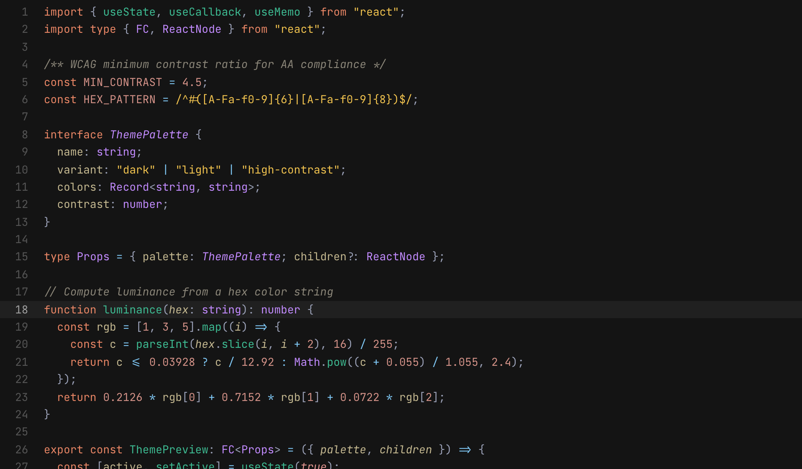
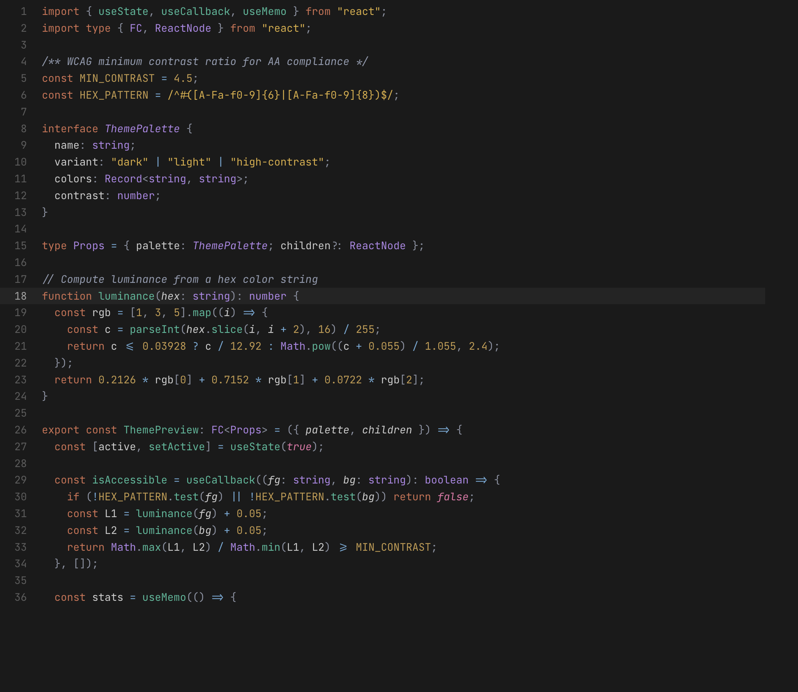
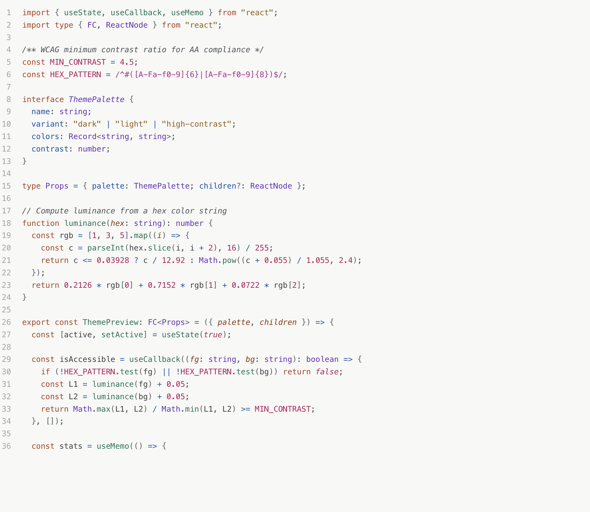
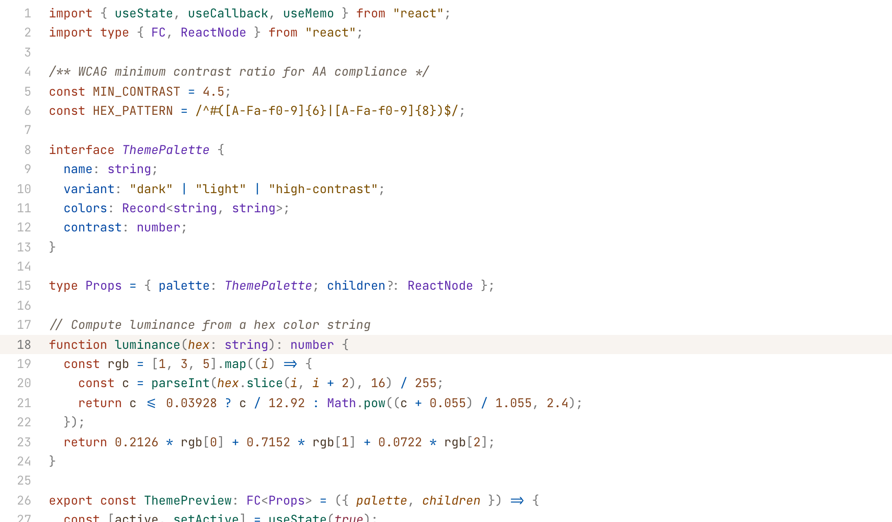
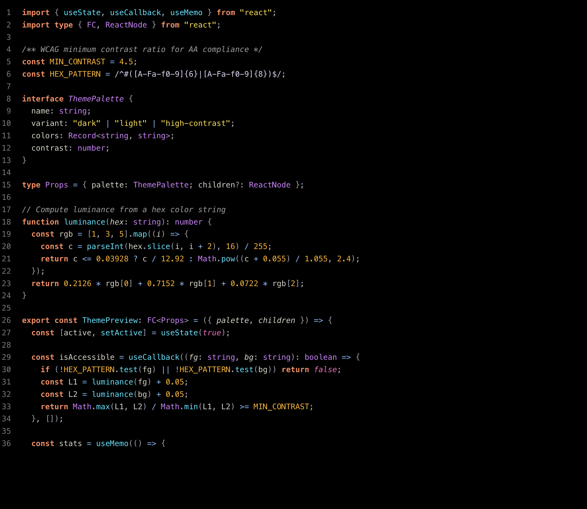

# Terracotta

A strikingly vibrant, carefully crafted VS Code theme. Five variants for every environment and every pair of eyes.

[](https://marketplace.visualstudio.com/items?itemName=terracotta-theme.terracotta-theme)
[](https://marketplace.visualstudio.com/items?itemName=terracotta-theme.terracotta-theme)
[](https://marketplace.visualstudio.com/items?itemName=terracotta-theme.terracotta-theme)
[](LICENSE)

**Zero WCAG AA failures. Up to 100% AAA compliance.**

---

## Variants

### Terracotta Dark

The primary variant. A deep, neutral dark theme for daily coding. Pure dark backgrounds (`#141414`) with warm, desaturated accents tuned for extended sessions without eye strain.



| Role        | Color                                                        | Hex       |
|-------------|--------------------------------------------------------------|-----------|
| Background  |    | `#141414` |
| Foreground  |    | `#D4D4D4` |
| Accent      |    | `#DA7756` |
| Keywords    |    | `#DA7756` |
| Functions   |    | `#2EE5B2` |
| Strings     |    | `#F0C24E` |
| Types       |    | `#C28BFF` |
| Numbers     |    | `#D0A050` |
| Operators   |    | `#7FC7F4` |
| Decorators  |    | `#C28BFF` |

### Terracotta Dark Dimmed

Lower contrast for prolonged night sessions. Built on a softer grey (`#1A1A1A`) with all syntax colors desaturated and dimmed — easier on the eyes when the lights are off, without losing syntax distinctness.



| Role        | Color                                                        | Hex       |
|-------------|--------------------------------------------------------------|-----------|
| Background  |    | `#1A1A1A` |
| Foreground  |    | `#CCCCCC` |
| Accent      |    | `#C4785E` |
| Keywords    |    | `#D06F50` |
| Functions   |    | `#3CB898` |
| Strings     |    | `#DBAC3B` |
| Types       |    | `#AF85E6` |
| Numbers     |    | `#C49A4A` |
| Operators   |    | `#6CA9D6` |

### Terracotta Light

A warm paper-like light theme using a beautifully soft off-white background (`#F8F8F6`). Deep, saturated jewel-toned syntax colors for crisp daytime reading.



| Role        | Color                                                        | Hex       |
|-------------|--------------------------------------------------------------|-----------|
| Background  |    | `#F8F8F6` |
| Foreground  |    | `#242424` |
| Accent      |    | `#C15F3C` |
| Keywords    |    | `#AB3D1E` |
| Functions   |    | `#007157` |
| Strings     |    | `#7A5000` |
| Types       |    | `#6530B8` |
| Numbers     |    | `#B4135B` |
| Operators   |    | `#0057AB` |
| Decorators  |    | `#6530B8` |

### Terracotta Light Bright

Near-perfect accessibility on a pure white background (`#FFFFFF`). 99% of syntax tokens meet WCAG AAA (7:1+). Bold borders and the sharpest contrast profile for bright environments and high-resolution displays.



| Role        | Color                                                        | Hex       |
|-------------|--------------------------------------------------------------|-----------|
| Background  |    | `#FFFFFF` |
| Foreground  |    | `#141414` |
| Accent      |    | `#DA7756` |
| Keywords    |    | `#9E341A` |
| Functions   |    | `#00654D` |
| Strings     |    | `#7C4F00` |
| Types       |    | `#5E29AD` |
| Numbers     |    | `#AA0E53` |
| Operators   |    | `#0055A8` |

### Terracotta High Contrast (Color Blind)

Built for pure accessibility on a true black (`#000000`) background. Uses a scientifically validated palette avoiding red/green combinations entirely. Every syntax element passes WCAG AAA (7:1+), with contrasts reaching 16:1.



| Role        | Color                                                        | Hex       | Contrast    |
|-------------|--------------------------------------------------------------|-----------|-------------|
| Background  |    | `#000000` | N/A         |
| Foreground  |    | `#FFFFFF` | 21.0:1      |
| Keywords    |    | `#FF8A5C` | 9.0:1       |
| Functions   |    | `#00E5FF` | 13.7:1      |
| Strings     |    | `#FFDF33` | 15.9:1      |
| Types       |    | `#D580FF` | 8.4:1       |
| Numbers     |    | `#FFB000` | 11.5:1      |
| Operators   |    | `#80BFFF` | 10.8:1      |
| Self/this   |    | `#D580FF` | 8.4:1       |

Accessible to deuteranopia, protanopia, and tritanopia.

---

## Installation

### From the Marketplace

1. Open **Extensions** in VS Code (`Ctrl+Shift+X` / `Cmd+Shift+X`)
2. Search for **Terracotta**
3. Click **Install**
4. Open the Command Palette (`Ctrl+Shift+P` / `Cmd+Shift+P`)
5. Select **Preferences: Color Theme**
6. Pick your preferred Terracotta variant

### Manual / From Source

```bash
git clone https://github.com/ceharsh24/terracotta-theme.git ~/.vscode/extensions/terracotta-theme
```

Restart VS Code and select a Terracotta variant from **Preferences: Color Theme**.

---

## Supported Languages

Syntax highlighting has been meticulously mapped for:

| Language       | Language       | Language      |
|----------------|----------------|---------------|
| JavaScript     | TypeScript     | Python        |
| Rust           | Go             | Java          |
| C / C++        | C#             | Ruby          |
| PHP            | Swift          | Kotlin        |
| HTML           | CSS / SCSS     | JSON          |
| YAML           | SQL            | Shell / Bash  |
| Markdown       | Dockerfile     | TOML          |

Semantic highlighting is enabled out-of-the-box for richer, context-aware coloring when supported by language servers.

---

## Theme Anatomy

Each variant provides:

- **200+ workbench colors** — precise styling for the editor, sidebar, terminal, diffs, menus, inputs, and every nook of the IDE.
- **75+ TextMate token rules** — comprehensive coverage across all standard grammars.
- **30+ semantic token rules** — deep integration with language servers.

---

## Accessibility & Design

Every color in every variant has been validated against WCAG accessibility standards. Zero AA failures across the board.

### WCAG Compliance

| Variant | AAA Compliance | AA Compliance |
|---------|---------------|---------------|
| Terracotta Dark | 78% | 100% |
| Terracotta Dark Dimmed | 42% | 100% |
| Terracotta Light | 37% | 100% |
| Terracotta Light Bright | 99% | 100% |
| Terracotta HC (Color Blind) | 100% | 100% |

*Contrast ratios for key syntax elements (foreground vs background):*

| Variant | Editor | Comment | Keyword | Function | String | Number |
|---------|--------|---------|---------|----------|--------|--------|
| Dark | 12.43 | 7.43 | 5.93 | 11.38 | 10.99 | 9.24 |
| Dark Dimmed | 10.84 | 6.25 | 5.03 | 7.05 | 8.27 | 7.63 |
| Light | 14.60 | 7.46 | 5.78 | 5.64 | 6.64 | 6.20 |
| Light Bright | 18.42 | 7.08 | 7.09 | 7.07 | 7.06 | 7.25 |
| HC (Color Blind) | 21.00 | 8.03 | 9.04 | 13.65 | 15.85 | 11.46 |

### Design Choices

**Warm color harmony with clear separation.** Dark variants use a yellow-gold for strings and a distinct amber for numbers. This retains the warm palette while ensuring each token type is visually distinguishable at a glance. Semantic highlighting adds further context-aware coloring when supported.

**Deep grey backgrounds.** The dark variants use `#141414` and `#1A1A1A` rather than pure black. This reduces halation (the neon glow effect around bright text on black backgrounds) and is easier on eyes with astigmatism.

**True inclusivity.** The high-contrast color-blind variant uses a research-backed palette ensuring zero red-green reliance and mathematically guarantees WCAG AAA standards across the board. Accessible to deuteranopia, protanopia, and tritanopia.

---

## Inspiration & Credits

- [Cursor IDE](https://cursor.sh/) — The inspiration behind the neutral dark-grey base.
- [IBM Design / Color Blind Safe Palette](https://lospec.com/palette-list/ibm-color-blind-safe) — accessible color choices
- [Wong (2011)](https://www.nature.com/articles/nmeth.1618) — color-blind-safe palette for scientific visualization

---

## Contributing

Contributions are welcome. If you find a language where token colors feel off, open an issue with a code sample and a screenshot.

## License

[MIT](LICENSE)
