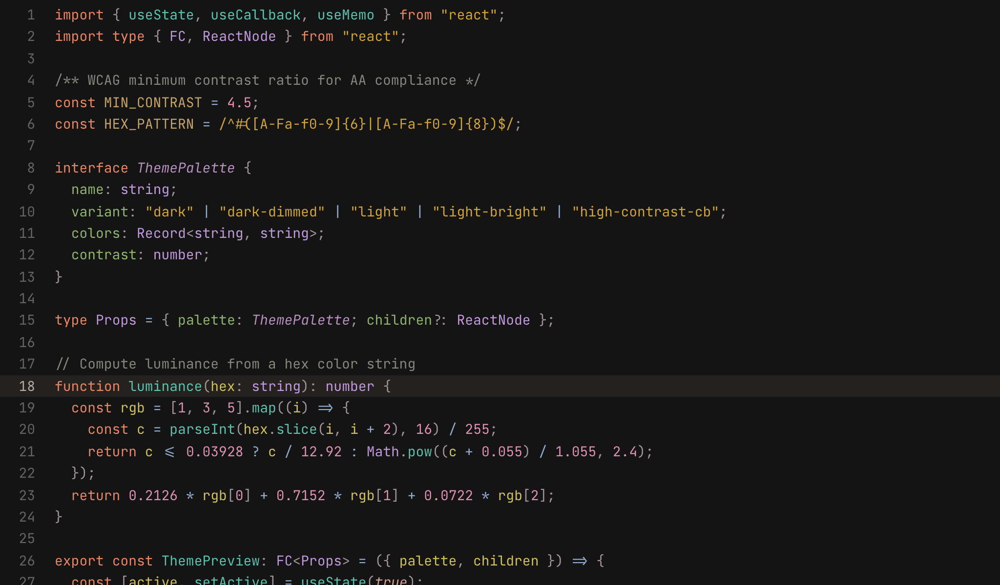
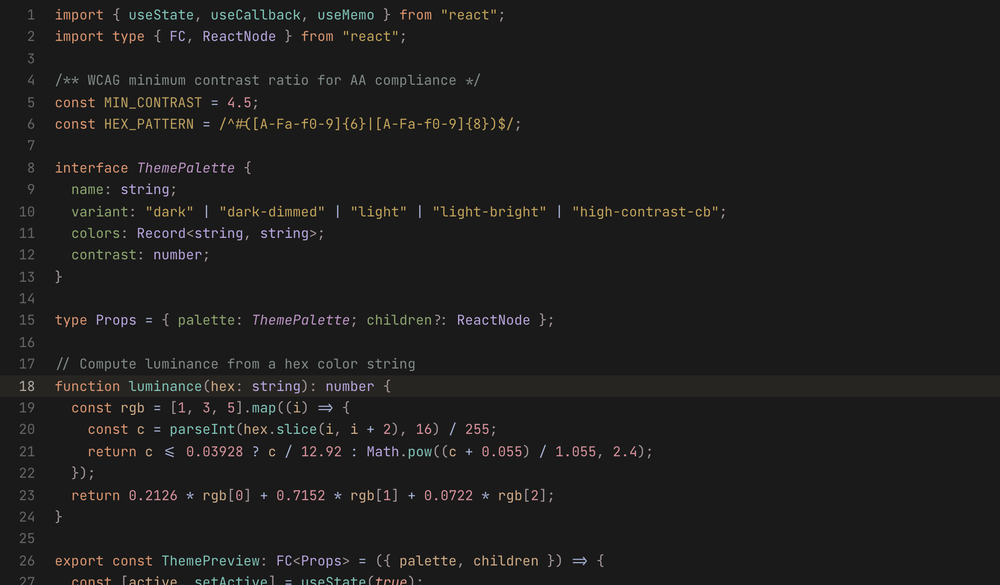
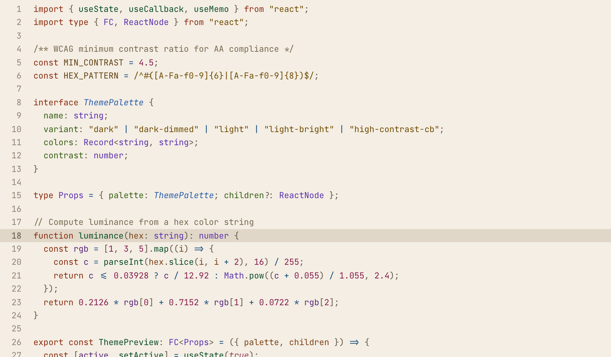
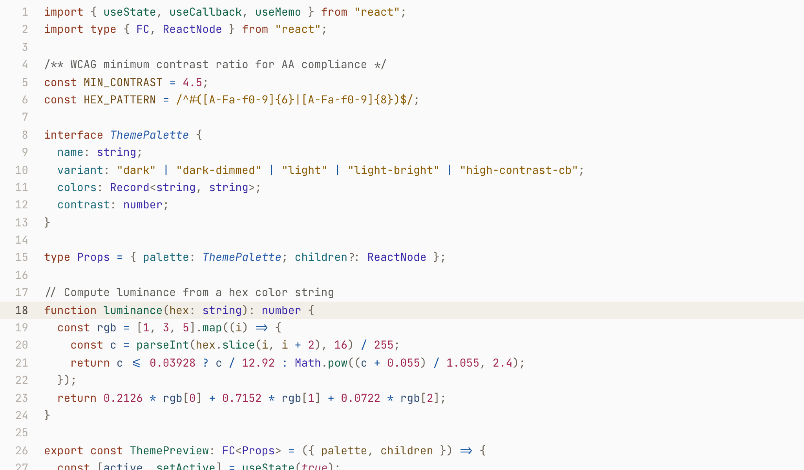
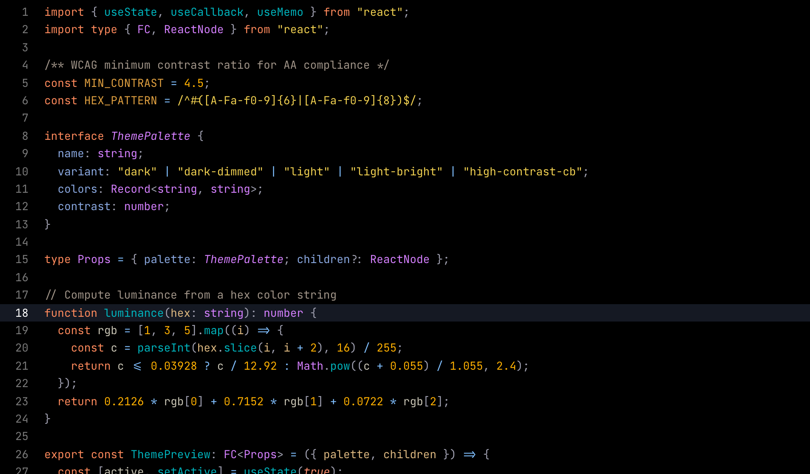

# Terracotta

A strikingly vibrant, carefully crafted VS Code theme. Five variants for every environment and every pair of eyes.

[](https://marketplace.visualstudio.com/items?itemName=terracotta-theme.terracotta-theme)
[](https://marketplace.visualstudio.com/items?itemName=terracotta-theme.terracotta-theme)
[](https://marketplace.visualstudio.com/items?itemName=terracotta-theme.terracotta-theme)
[](LICENSE)

**WCAG-validated syntax, UI, and terminal contrast across all 5 variants. 378 syntax/UI pairs plus 70 terminal ANSI colors validated automatically.**

---

## Variants

### Terracotta Dark

The primary variant. A deep, neutral dark theme for daily coding. Pure dark backgrounds (`#141414`) with warm, desaturated accents tuned for extended sessions without eye strain.



| Role        | Color                                                        | Hex       |
|-------------|--------------------------------------------------------------|-----------|
| Background  |    | `#141414` |
| Foreground  |    | `#D4D4D4` |
| Accent      |    | `#E98665` |
| Keywords    |    | `#E98665` |
| Functions   |    | `#5AAFA0` |
| Strings     |    | `#E8B830` |
| Types       |    | `#C09ADC` |
| Numbers     |    | `#E090B0` |
| Operators   |    | `#8DA4C4` |
| Decorators  |    | `#B468A0` |

### Terracotta Dark Dimmed

Lower contrast for prolonged night sessions. Built on a softer grey (`#1A1A1A`) with all syntax colors desaturated and dimmed — easier on the eyes when the lights are off, without losing syntax distinctness.



| Role        | Color                                                        | Hex       |
|-------------|--------------------------------------------------------------|-----------|
| Background  |    | `#1A1A1A` |
| Foreground  |    | `#CCCCCC` |
| Accent      |    | `#C4785E` |
| Keywords    |    | `#DA956F` |
| Functions   |    | `#80C4B8` |
| Strings     |    | `#C2A35A` |
| Types       |    | `#B8A6DE` |
| Numbers     |    | `#D8929C` |
| Operators   |    | `#A8B4D8` |
| Decorators  |    | `#AC749C` |

### Terracotta Light

An editorial warm light theme built on parchment surfaces (`#F4EEE4`). Navy operators, purple variables, rust parameters, forest functions, and a restrained terracotta accent keep lanes separated on the warm canvas.



| Role        | Color                                                        | Hex       |
|-------------|--------------------------------------------------------------|-----------|
| Background  |    | `#F4EEE4` |
| Foreground  |    | `#2A241F` |
| Accent      |    | `#B66743` |
| Keywords    |    | `#8C2A0E` |
| Functions   |    | `#064A26` |
| Strings     |    | `#6E4A00` |
| Types       |    | `#5A2FAE` |
| Numbers     |    | `#84184A` |
| Operators   |    | `#124878` |
| Decorators  |    | `#6A2E90` |

### Terracotta Light Bright

A crisp neutral daylight variant: pure neutral editor (`#FAFAFA`), micro-warm near-neutral chrome, hero terracotta accent (`#D8744E`), and rust keywords so the family stays recognizable without cool-grey chrome.



| Role        | Color                                                        | Hex       |
|-------------|--------------------------------------------------------------|-----------|
| Background  |    | `#FAFAFA` |
| Foreground  |    | `#1F1F1F` |
| Accent      |    | `#D8744E` |
| Keywords    |    | `#963014` |
| Functions   |    | `#145A32` |
| Strings     |    | `#7A5600` |
| Types       |    | `#213B67` |
| Numbers     |    | `#A02450` |
| Operators   |    | `#0E4F96` |

### Terracotta High Contrast (Color Blind)

Built for pure accessibility on a true black (`#000000`) background. Uses a scientifically validated palette avoiding red/green combinations entirely. Every syntax element passes WCAG AAA (7:1+), with contrasts reaching 21:1.



| Role        | Color                                                        | Hex       | Contrast    |
|-------------|--------------------------------------------------------------|-----------|-------------|
| Background  |    | `#000000` | N/A         |
| Foreground  |    | `#FFFFFF` | 21.0:1      |
| Keywords    |    | `#FF8A5C` | 9.0:1       |
| Functions   |    | `#00B4BD` | 8.3:1       |
| Strings     |    | `#F0D050` | 13.8:1      |
| Types       |    | `#D580FF` | 8.4:1       |
| Numbers     |    | `#FFB000` | 11.5:1      |
| Operators   |    | `#80BFFF` | 10.8:1      |
| Self/this   |    | `#FFD060` | 14.4:1      |

Accessible to deuteranopia, protanopia, and tritanopia.

> **Note:** The High Contrast (Color Blind) variant intentionally uses **blue** for "added" and **cyan** for "modified" in git decorations instead of the traditional green/blue. This avoids red-green color pairs that are indistinguishable with deuteranopia or protanopia. If you're used to green meaning "added," this is by design, not a bug.

---

## Installation

### From the Marketplace

1. Open **Extensions** in VS Code (`Ctrl+Shift+X` / `Cmd+Shift+X`)
2. Search for **Terracotta**
3. Click **Install**
4. Open the Command Palette (`Ctrl+Shift+P` / `Cmd+Shift+P`)
5. Select **Preferences: Color Theme**
6. Pick your preferred Terracotta variant

### Manual / From Source

```bash
git clone https://github.com/ceharsh24/terracotta-theme.git ~/.vscode/extensions/terracotta-theme
```

Restart VS Code and select a Terracotta variant from **Preferences: Color Theme**.

---

## Recommended settings

To get the most out of Terracotta, use a font with solid italic and bold support (e.g. **JetBrains Mono**, **Fira Code**, **Cascadia Code**). The theme uses italics for doc blocks and select secondary accents, and bold for markdown headings and bold markup.

The extension sets these defaults when you install it (you can override any in your user settings):

| Setting | Default | Why |
|--------|---------|-----|
| `editor.semanticHighlighting.enabled` | `true` | Enables context-aware colors (functions, types, parameters) that the theme is tuned for. |
| `editor.bracketPairColorization.enabled` | `true` | Uses the theme’s bracket colors for matching pairs. |
| `editor.guides.bracketPairs` | `true` | Shows vertical guides for bracket scope. |
| `editor.renderLineHighlight` | `"line"` | Highlights the current line with the theme’s line highlight. |
| `editor.cursorBlinking` | `"smooth"` | Matches the theme’s smooth, low-distraction feel. |

Optional: for a closer match to the repo screenshots and the theme’s design, set a monospace font and size in your user `settings.json`:

```json
{
  "editor.fontFamily": "JetBrains Mono, Fira Code, Cascadia Code, monospace",
  "editor.fontSize": 14,
  "editor.lineHeight": 1.6
}
```

---

## Supported Languages

Syntax highlighting has been meticulously mapped for:

| Language       | Language       | Language      |
|----------------|----------------|---------------|
| JavaScript     | TypeScript     | Python        |
| Rust           | Go             | Java          |
| C / C++        | C#             | Ruby          |
| PHP            | Swift          | Kotlin        |
| HTML           | CSS / SCSS     | JSON          |
| YAML           | SQL            | Shell / Bash  |
| Markdown       | Dockerfile     | TOML          |

Semantic highlighting is enabled out-of-the-box for richer, context-aware coloring when supported by language servers. If colors look off, ensure it is enabled in your settings:

```json
"editor.semanticHighlighting.enabled": true
```

---

## Theme Anatomy

Each variant provides:

- **380+ workbench colors** — precise styling for the editor, sidebar, terminal, diffs, menus, inputs, and every nook of the IDE.
- **140 TextMate token rules** — comprehensive coverage across all standard grammars, including JSX/TSX, GraphQL, TOML, Dockerfile, Shell/Bash, and YAML.
- **43+ semantic token rules** — deep integration with language servers.

---

## Accessibility & Design

378 syntax/UI pairs plus 70 terminal ANSI colors across all 5 variants are validated against WCAG 2.1 standards using the automated checks in `npm test`.

### WCAG Compliance

A tiered system ensures the best balance of readability and color differentiation:

| Category | Pairs | Standard | Result |
|----------|-------|----------|--------|
| Core syntax (Tier 1) | ~35 | AAA (7:1) | 100% pass |
| Supporting syntax (Tier 2) | ~80 | AA (4.5:1) | 100% pass |
| UI text (active) | ~200 | AA (4.5:1) | 100% pass |
| UI text (exempt) | ~33 | — | Intentionally subdued |

**Tier 1** — keyword, function, string, variable, type, number, operator — the tokens you read thousands of times a day.
**Tier 2** — comment, constant, parameter, property, tag, attribute, punctuation, regex, macro, decorator — supporting tokens where color differentiation matters more than raw contrast.

**Exempt elements** — line numbers, inactive tabs/icons/titles, input placeholders, CodeLens, and inlay hints — are intentionally low-contrast per WCAG SC 1.4.3 (inactive user interface components).

*Contrast ratios for key syntax elements (foreground vs background):*

| Variant | Editor | Comment | Keyword | Function | String | Number |
|---------|--------|---------|---------|----------|--------|--------|
| Dark | 12.4 | 5.0 | 7.1 | 7.1 | 9.9 | 8.1 |
| Dark Dimmed | 10.8 | 5.0 | 7.0 | 7.1 | 9.8 | 8.0 |
| Light | 13.3 | 4.9 | 6.0 | 7.2 | 5.3 | 7.6 |
| Light Bright | 15.9 | 5.3 | 5.1 | 7.8 | 5.1 | 8.3 |
| HC (Color Blind) | 21.0 | 7.0 | 9.0 | 8.3 | 13.8 | 11.5 |

### Design Choices

**Warm color harmony with clear separation.** Each color family has a dedicated role: terracotta for keywords, teal for functions, ochre for strings, violet/indigo for types, berry for numbers, cocoa for identifiers, olive for properties, and slate for structural syntax. The two light variants now diverge intentionally: Light keeps warmer editorial surfaces, while Light Bright leans cleaner and cooler in its structure lane.

**Distinct identifiers vs properties.** In the dark themes, variables and parameters share a warm sand (`#D9A06D` Dark, `#CFAA86` Dimmed) while properties use an olive-clay accent (`#A8A060` Dark, `#8DA56E` Dimmed). That split improves scan speed in object-heavy JavaScript/TypeScript, JSON, YAML, and config files without breaking the warm terracotta identity.

**Deep grey backgrounds.** The dark variants use `#141414` and `#1A1A1A` rather than pure black. This reduces halation (the neon glow effect around bright text on black backgrounds) and is easier on eyes with astigmatism.

**Distinct light personalities.** The Light variant keeps parchment surfaces (`#F4EEE4`) with warmer biscuit chrome and editorial warmth. Light Bright uses a neutral daylight canvas (`#FAFAFA`), near-warm chrome, and the same hero terracotta accent so it reads as a separate crisp theme instead of a brighter clone.

**True inclusivity.** The high-contrast color-blind variant uses a research-backed palette ensuring zero red-green reliance and mathematically guarantees WCAG AAA standards across the board. Accessible to deuteranopia, protanopia, and tritanopia.

---

## Inspiration & Credits

- [Cursor IDE](https://cursor.sh/) — The inspiration behind the neutral dark-grey base.
- [IBM Design / Color Blind Safe Palette](https://lospec.com/palette-list/ibm-color-blind-safe) — accessible color choices
- [Wong (2011)](https://www.nature.com/articles/nmeth.1618) — color-blind-safe palette for scientific visualization

---

## Contributing

Contributions are welcome. If you find a language where token colors feel off, open an issue with a code sample and a screenshot.

## License

[MIT](LICENSE)
